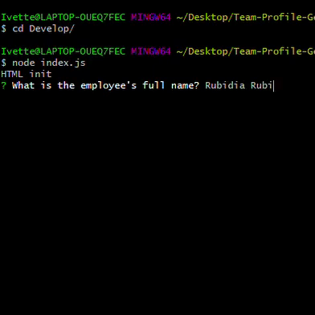
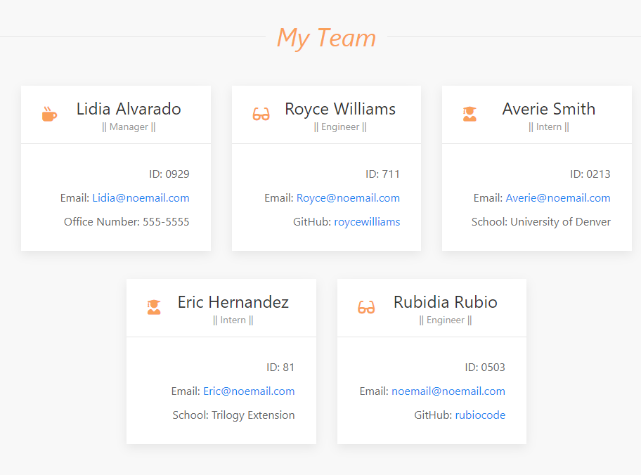
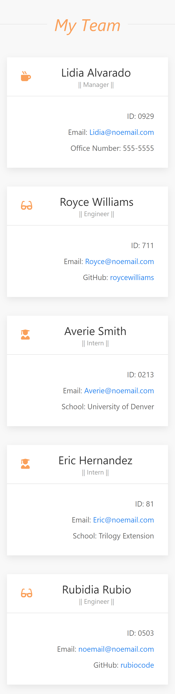
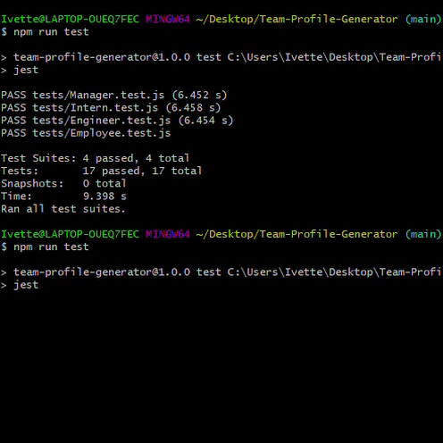

<div align="center">

# Team Profile Generator

 URL of the GitHub repository: https://github.com/rubiocode/Team-Profile-Generator

 URL of sample team page created by the application: https://rubiocode.github.io/Team-Profile-Generator/Develop/output/team.html

</div>

## Table of Contents 

* [Description](#description)
    * [User Story](#user-story)
    * [Acceptance Criteria](#acceptance-criteria)
* [Installation](#installation)
* [Usage](#usage)
* [View](#view)
    * [Inquirer Prompts](#inquirer-prompts)
    * [Team Roster](#team-roster)
    * [Responsive Layout](#responsive-layout)
* [Tests](#tests)
* [Built With](#built-with)
* [Credits](#credits)
* [License](#license)

## Description

This command line application will prompt the user for information about their team and generate a nicely formatted and responsive HTML page displaying the roster of their team members. In addition, the user has the option to enter as many team members possible whether they are managers, engineers and/or interns. 

### User Story

```md
AS A manager
I WANT to generate a webpage that displays my team's basic info
SO THAT I have quick access to their emails and GitHub profiles
```

### Acceptance Criteria

- [x] Command line that accepts user input
- [x] A team profile HTML page is generated
- [x] Team profile contains 'Manager', 'Intern', and 'Engineer" role options
- [x] Based on role options, a different prompt is populated with specific questions about their role.  
- [x] When 'Manager' role selected, the user is prompted to enter office manager phone number. 
- [x] When 'Intern' role selected, the user is prompted to enter attending school.
- [x] When 'Engineer' role selected, the user is prompted to enter GitHub user name. 
- [x] All links in generated html file work appropiately


## Installation

To start using this _Team Profile Generator_ you must follow these instructions:

* Fork and clone this repository and save it to your computer. For help how to fork and clone click [here](https://guides.github.com/activities/forking/) 

* Open your terminal and make sure noje.js is installed. To download node.js click [here](https://nodejs.org/en/download/)

* Once you have downloaded node.js, run 'node index.js' to get the prompts to populate. Important: make sure you are in the same folder where 'index.js' is located when running this command. 

* A responsive and formatted _Team Roster HTML_ page will generate automatically upon completion from your terminal. Your team roster will be located in the _Output_ folder. 


## Usage

How to use this application:


```bash
    node index.js
```

this command will populate a series of prompts that will generate you team roster HTML page. Have the following prompts ready to answer:

```bash
    Please enter your full name.
    Please enter your ID.
    Please enter your email.
    Please select your role [Manager, Intern, Engineer].
    Manager ONLY: Please enter your office number.
    Intern ONLY: Please enter your school.
    Engineer ONLY: Please enter GitHub username.
    Add another member (Y/N).
```
Once all members have been added, terminal will display success message and HTML page will be ready to view under Output folder. 

## View

### Inquirer Prompts

This is what the inquirer command-line prompts look like: 



### Team Roster 
This is an example of what the team generated HTML page looks like in a regular sized screen.



### Responsive Layout
Here is a screenshot of the responsive layout of the HTML page.




## Tests

To run the tests in the test directory, run the following command:
```
npm test
```




## Built With

* [Node.js](https://nodejs.dev/learn/) - Node.js is an open-source, low-level, back-end JavaScript runtime platform that uses asynchronous programming and is a popular tool for almost any kind of project!.  

* [UIkit](https://getuikit.com/docs/introduction) - a lightweight and modular front-end framework for developing fast and powerful web interfaces.

* [Jest](https://www.npmjs.com/package/jest) - common JS testing framework with a focus on simplicity. 

* [Inquirer](https://www.npmjs.com/package/inquirer) - A collection of common interactive commands line user interfaces.

* [JavaScript ES6](https://www.w3schools.com/Js/js_es6.asp) - Programming language that creates dynamic website content. ES6 or ECMAScript 6 was the second major revision to JavaScript.

* [FS](https://nodejs.org/dist/latest-v14.x/docs/api/fs.html) - File system module allows the user to interact and work with the file system in the user's computer. 

## Credits

Starting files from © 2021 Trilogy Education Services, LLC, a 2U, Inc. brand. Confidential and Proprietary. All Rights Reserved.

## License

Copyright 2021 Rubidia Rubio

Licensed under the [MIT License](https://opensource.org/licenses/MIT)


